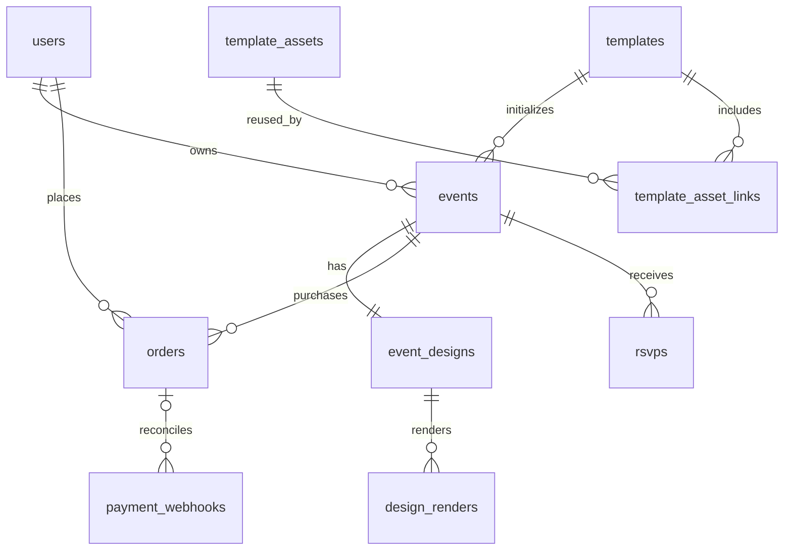

# مخطط العلاقات

event_designs.event_id الفريد يمنع أكثر من تصميم للمناسبة. إنشاء المناسبة والتصميم في transaction واحدة يضمن وجود التصميم؛ FK وحده لا يفرض وجود الابن. قد يصل webhook قبل مطابقة الطلب ولذلك order_id اختياري مؤقتاً. final_render_path يشير للنسخة المنشورة، وdesign_json يحتفظ بالمسودة الحالية.
