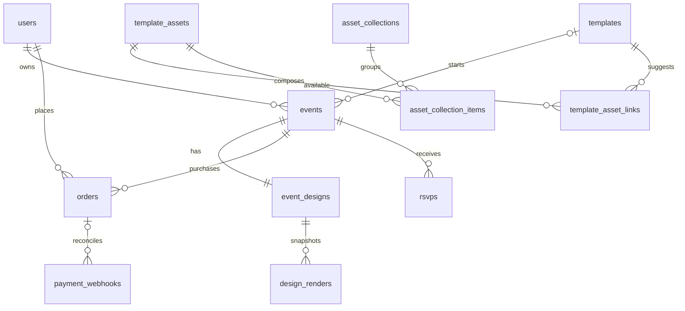

# ميثاق — المخطط الشامل 2.0

الحالة: خطة منتج وتنفيذ معتمدة من المستخدم بتاريخ 2026-09-09؛ لا كود منفذ. خطوات العمل التفصيلية في [قائمة التنفيذ](10-execution-checklist.md). يعتمد طلب المستخدم الأخير بتجربة Mix & Match واقتراحات تخصيص الألوان والعناصر والخطوط والمعاينة. عند التعارض مع ملفات الإصدار 1.0، هذا الملف هو المرجع الأحدث للمنتج والتصميم؛ الضوابط المالية والأمنية السابقة تبقى سارية. التسعير والسياسات التجارية غير المحسومة تبقى قرارات مفتوحة.

## 1. تعريف المنتج

ميثاق منصة عربية لإنشاء دعوة رقمية من عناصر قابلة للاختيار والتركيب، مع قالب كبداية اختيارية. يخصص المستخدم البطاقة والمشهد المحيط بها، يعاين التجربة كاملة، ثم يدفع لينشرها على نطاق فرعي مؤقت. يمكن تغيير الخلفية والخط والزخارف والظرف والمؤثر دون الالتزام بعناصر قالب واحد.

مثال مرجعي: خلفية بودرية + لمعة مستوحاة من التصميم العنابي + أسماء إنجليزية بخط Pinyon Script + دعاء عربي بخط أميري + تفاصيل بخط تجوال + ظرف بلون مناسب وختم بالأحرف الأولى.

لا نغير Laravel 12 / PHP 8.3+ / React 19 / TypeScript strict / Inertia v2 / Fabric v6 / MySQL أو Modular DDD.

## 2. حدود النسخة الأولى والمراحل اللاحقة

| الوظيفة | النسخة الأولى | التوسعة اللاحقة |
|---|---|---|
| بداية التصميم | قالب جاهز أو بطاقة فارغة بالمقاس المدعوم | مقاسات مخصصة متعددة |
| الفئات | زفاف، حنة، عقد قران، تخرج | فئات إضافية |
| الألوان | لون أساسي وأدوار لونية وتعديل مستقل | توليد لوحات أكثر تقدماً |
| الخطوط | خط لكل جزء، عربي أو إنجليزي أو مختلط | خطوط إضافية مرخصة |
| الأصول | مكتبة مشتركة وصور وSVG آمنة ومجموعات جاهزة | رفع ملفات المستخدم بعد بناء معالجة آمنة |
| أدوات التحرير | تحريك، حجم، تدوير، طبقات، محاذاة، قفل، إخفاء، تراجع وإعادة | تحرير مسارات ورسوم متقدم |
| المؤثرات | لمعان ودخان اختياريان، لون وشدة وسرعة ضمن حدود | متجر مؤثرات إضافية |
| الدخول | مباشر، ظهور ناعم، ظرف | أنماط أخرى |
| الصوت | مقاطع مكتبة مع تشغيل/كتم ومستوى صوت | رفع صوت العميل بعد ضبط الحقوق والمعالجة |
| نسخ التصميم | نسخ داخل المناسبة والمقارنة مؤجلة | بدائل متعددة، واحدة منشورة |
| هوية عدة مناسبات | مؤجلة | حنة/عقد/زفاف بنفس الهوية، بدفع وصلاحية مستقلين |
| الضيوف | دعوة تفاعلية وRSVP | رموز دعوة فردية وإدارة قوائم ضيوف |

يدخل اختيار مجموعات عناصر بسيطة في النسخة الأولى؛ لا يدخل محرر لإنشاء مجموعات عامة للمستخدم. اعتماد اللون العام للمحرر والعلامة التجارية منفصل عن ألوان دعوات العملاء.

## 3. رحلة صاحب المناسبة

1. يتصفح القوالب حسب الفئة والطابع اللوني، مع معاينة مصغرة.
2. يسجل الدخول، وينشئ مناسبة بعنوان وموعد ومنطقة زمنية؛ السنة والوقت مطلوبان حتى لو أخفاهما بصرياً.
3. يختار قالباً أو بداية فارغة. ينشئ الخادم المناسبة والتصميم ويحجز نطاقاً فريداً.
4. يكتب بيانات الدعوة: أسماء، عنوان افتتاحي، دعاء، تفاصيل. يحدد لغة واتجاه كل نص.
5. يركب الخلفية والزخارف والخطوط والألوان، ثم يضبط الظرف والمؤثرات والصوت.
6. الحفظ تلقائي مع إقرار الخادم ورقم revision؛ لا تضيع المسودة المحلية عند تعارض حفظ.
7. يستخدم «معاينة كضيف» لرؤية فتح الظرف والحركة والصوت والبطاقة وRSVP بحجم الهاتف. نموذج RSVP في معاينة المالك غير مرسل إلى سجلات الضيوف.
8. يراجع السعر والعملة والصلاحية ثم يدفع. الرجوع من البوابة لا يثبت الدفع؛ Webhook موثوق هو المرجع.
9. يرى «تم الدفع، نجهز الدعوة» حتى اكتمال إصدار صالح للنشر، ثم ينسخ الرابط.
10. يعدل مسودته لاحقاً ويضغط «تحديث الدعوة»؛ النسخة التي يشاهدها الضيوف تبقى حتى ينجح الإصدار البديل.
11. يتابع تأكيدات الحضور. عند expires_at يغلق الرابط دون انتظار الأمر اليومي.

## 4. تركيب التصميم: البطاقة والمشهد

### أ. البطاقة — Fabric.js

نصوص، صور، خلفيات ثابتة، أشكال، إطارات وزهور وزخارف. لكل طبقة id ثابت، نوع، موقع، مقاس، دوران، شفافية، visible وlocked. ترتيب المصفوفة هو ترتيب الطبقات؛ لا يكرر في حقل ترتيب آخر. خط أساس الإحداثيات مستقل عن دقة المعاينة.

مقاس منطقي أولي مقترح 1080×1920 للبطاقة العمودية، مع سياسة واضحة لالتفاف النص العربي. المعاينة قد تكون بدقة أقل، لكن الإحداثيات الأصلية لا تتغير. تمدد صفحة الضيوف خارج البطاقة لاستيعاب RSVP.

### ب. المشهد — React

الخلفية المحيطة، دخان/لمعان، الظرف والختم، حركة الدخول، ومشغل الصوت. هذه مكونات معروفة في التطبيق؛ يختار المستخدم إعداداتها ولا يكتب JavaScript أو HTML أو shaders.

دعوة الضيف تجمع المشهد مع صورة البطاقة النهائية وHTML للعنوان والموعد وRSVP. الصورة النهائية لا تحتوي الموسيقى أو الحركة. عند فشل الحركة يظهر بديل ثابت وتظل تفاصيل المناسبة ونموذج RSVP قابلين للاستخدام.

### ج. وضوح نطاق كل أداة

لوحة «البطاقة» تحرر عناصر Fabric؛ لوحة «العرض» تضبط المشهد. «معاينة كضيف» تجمع الاثنين. الظرف والصوت ليسا طبقات قابلة للسحب فوق البطاقة. اللمعة قد تعرض خلف البطاقة؛ بطاقة ذات خلفية معتمة تحجب المؤثر خلفها، لذلك المعاينة تبين النتيجة الفعلية ويحدد القالب إن كان يسمح بخلفية شفافة.

## 5. مكتبة Mix & Match

### العناصر الثابتة

- خلفيات قابلة للتلوين أو صور خلفية.
- إطارات وزهور وأوراق وفواصل وأيقونات.
- خطوط عربية وإنجليزية مع fallback معروف.
- مجموعات جاهزة مثل «زهور ناعمة»: زوايا وفاصل وإطار؛ تضاف كعناصر مستقلة يمكن تعديلها.
- استبدال عنصر يحافظ على bounding box والمركز والدوران والشفافية؛ تضبط ملاءمة الصورة مع الحفاظ على نسبتها، ولا يشوه SVG أو النص لإجباره على مقاس مختلف.

الأصول الفعالة المشتركة متاحة عبر القوالب، وروابط القالب تحدد المقترحات والافتراضيات فقط. يتحقق الخادم من نوع الأصل وإتاحته وتوافقه، ولا يفرض الاقتصار على أصول القالب الأصلي.

### الألوان

لوحة ذات أدوار: background، surface، primaryText، secondaryText، accent، effect. ربط لون عنصر بدور يجعله يتغير مع اللوحة؛ override يفصل لونه عمداً. اختيار «بودري» يعرض توليفة جاهزة منسجمة ويمكن تعديلها.

لا يمكن وعد المستخدم بإعادة تلوين كل صورة. SVG والأشكال والمؤثرات ذات الألوان البرمجية تدعم التلوين؛ الصورة النقطية الأصلية قد تحتاج نسخة محايدة أو معالجة مسبقة. لتوفير «لمعة العنابي على بودري» نفصل اللمعان عن لون صورة الخلفية العنابية، ونستخدم خامة محايدة/قابلة للتلوين أو مؤثراً برمجياً، ثم نراجع النتيجة بصرياً.

### اللغة والخطوط

لغة الواجهة عربية RTL أولاً؛ لغة المحتوى لكل طبقة: ar أو en أو mixed، واتجاه النص rtl أو ltr أو auto، ومحاذاة مستقلة. لا ترجمة تلقائية ولا تحويل اسم عربي إلى اسم لاتيني تلقائياً. أميري وتجوال للنص العربي وPinyon Script للاتيني بحسب المراجع الحالية؛ تعطى للمستخدم توليفات جاهزة.

تختبر حروف عربية متصلة، تشكيل، أرقام وتواريخ ونص مختلط. تثبت ملفات الخطوط المستخدمة في المحرر والتصدير بعد مراجعة الرخص؛ انتظار اكتمال تحميل الخط شرط للتصدير. لا يفترض أن Pinyon يدعم العربية.

### المؤثرات

effectId وeffectVersion من registry موثوق؛ enabled وcolor وintensity وspeed بمعايير وحدود خادم واضحة. تبدأ القائمة بـ sparkle وsmoke، مع إمكانية تعطيل كل منهما. يراعى reduced-motion، وإيقاف الحركة يوقف الرسم فعلياً. على الأجهزة الضعيفة يستخدم fallback ثابت أو عدد جسيمات أقل. يتم اختبار اللون البودري فعلياً قبل وعد تطابقه مع المرجع.

## 6. الشاشات والتخطيط

| الشاشة | المكونات والهدف |
|---|---|
| الرئيسية | عرض أمثلة، شرح اختر/خصص/انشر، زر البدء |
| مكتبة القوالب | فئة، طابع لوني، صورة ومعاينة، بداية فارغة |
| لوحة المناسبات | حالات المسودات والمنشور والتجهيز والمنتهي، إنشاء وتحرير وحضور |
| إنشاء المناسبة | عنوان، فئة، قالب اختياري، موعد ومنطقة زمنية |
| المحرر | عناصر/ألوان/نصوص/طبقات/عرض، مساحة البطاقة، خصائص العنصر |
| معاينة الضيف | هاتف وسطح مكتب، حركة وصوت وحالة دفع وهمية غير قابلة للتلاعب بالخادم |
| الدفع | ملخص المناسبة والمبلغ والصلاحية وحالة التأكيد |
| حالة النشر | تجهيز/جاهز/فشل، رابط، نسخ، إعادة محاولة |
| الحضور | قائمة الردود والعدد المؤكد والمرافقين |
| الضيف | مشهد الافتتاح، بطاقة، عنوان وموعد ونموذج RSVP |
| حالات عامة | غير موجود، منتهي، تجهيز، تعذر الوصول |

```text
[ميثاق] [اسم المناسبة] [حالة الحفظ] [تراجع/إعادة] [معاينة] [ادفع وانشر]
[عناصر | ألوان | نصوص | طبقات | عرض] [البطاقة] [خصائص العنصر المحدد]
                                       [تكبير/تصغير]
```

الهاتف: شريط أدوات سفلي ولوحة خصائص قابلة للفتح، مع مساحة عمل قابلة للتحريك والتكبير. الأزرار والسحب لهما بدائل بلوحة المفاتيح، والخطوط الإرشادية تعرض المحاذاة والمسافات. تنبيه تباين النص إرشادي وقد يكون تقريبياً فوق الصور؛ تنبيه تجاوز حدود البطاقة يمنع القص غير المقصود.

الحالات: loading، empty، validation، saving، saved، offline، conflict، error، success. لا تظهر «محفوظ» قبل رد الخادم. تراجع/إعادة محليان ضمن الجلسة، ولا يعدان سجل نسخ دائم.

## 7. قاعدة البيانات المحدثة — 12 جدول أعمال

تبقى تفاصيل الأنواع والفهارس السابقة في 03-database-schema.md إلا الفروق التالية. المقترح الجديد 10 جداول سابقة + asset_collections وasset_collection_items. لا حاجة لجدول مستقل لكل لون أو تأثير؛ القيم في وثيقة التصميم وتعريفات القدرات في registry مضبوط بالإصدارات.

| الجدول | دوره والتحديث |
|---|---|
| users | حساب المالك؛ بلا تغيير |
| templates | نقطة بداية؛ category تشمل henna وmarriage_contract، وإضافة default_scene_json JSON وdefault_palette_json JSON |
| template_assets | مكتبة مشتركة؛ أنواع background/frame/icon/font/decoration/audio؛ حقول capabilities JSON وlicense_metadata JSON NULL وasset_version INT UNSIGNED افتراضي 1 |
| template_asset_links | اقتراحات القالب وترتيبها؛ لا تمنع استعمال أصل من قالب آخر |
| asset_collections | id، name VARCHAR(150)، thumbnail_path VARCHAR(1024) NULL، is_active BOOLEAN default true، timestamps |
| asset_collection_items | id، collection_id FK، template_asset_id FK، sort_order INT UNSIGNED، placement_json JSON، timestamps؛ UNIQUE(collection_id,sort_order) |
| events | category VARCHAR(24) مطلوب مستقل عن القالب؛ template_id يصبح NULL للبداية الفارغة؛ category enum wedding/henna/marriage_contract/graduation |
| event_designs | design_json للبطاقة، scene_json JSON، palette_json JSON، revision واحد للوثيقة كاملة، published_scene_json JSON NULL وpublished_palette_json JSON NULL |
| orders | السعر والعملة والدفع كما سبق |
| payment_webhooks | منع المعالجة المتكررة والاسترداد بعد التعطل كما سبق |
| design_renders | design_snapshot JSON يصبح snapshot كاملاً: بطاقة ومشهد ولوحة وقدرات بإصداراتها؛ يمنع القراءة من مسودة متغيرة أثناء التصيير |
| rsvps | الردود كما سبق؛ ليست جزءاً من وثيقة التصميم |

FK المجموعات: collection_id إلى asset_collections مع CASCADE للعنصر عند حذف المجموعة في أدوات التشغيل؛ template_asset_id إلى template_assets مع RESTRICT. فهرس template_asset_id؛ فهرس(is_active,name) في المجموعات. يسمح بتكرار الأصل داخل مجموعة في مواضع مختلفة. placement_json لا يقبل أكواد، ويحمل موضعاً ومقاساً ودور لون وخيارات طبقة مصرحاً بها. تحديث مجموعة المكتبة لا يعدل تصاميم المستخدمين السابقة.

capabilities تصف supportsTint، supportsOpacity، supportedScripts للخط، ومدة الصوت إن وجدت؛ تحقق نوعها على الخادم. تحديث أصل مستخدم لا يستبدل محتواه بصمت: تخزين إصدار جديد/مسار جديد مع إبقاء القديم للمناسبات المنشورة. is_active يمنع الاختيار الجديد؛ لا يكسر منشوراً قائماً إلا سحب أمني مقصود.

thumbnail_path للقوالب الجديدة يبقى مطلوباً؛ default_design_json للقالب يحوي البطاقة فقط. published_scene_json وpublished_palette_json وfinal_render_path وpublished_revision تثبت معاً ذرياً. لا تستخدم صفحة الضيف scene_json للمسودة. إزالة مسارات URLs الدائمة وتخزينها كـ paths الخاصة يبقى كما سبق.

وقت إنشاء مناسبة بلا قالب ينسخ الخادم وثيقة فارغة آمنة مع مقاس ولوحة افتراضيين. category من الطلب حينها؛ مع القالب تبدأ بفئته. templates category ليست المرجع الوحيد بعد النسخ.



## 8. العقد الموحد للتصميم

Document = schemaVersion + canvas + palette + scene. يحفظ في الأعمدة المخصصة ضمن transaction واحدة ورقم revision واحد؛ expectedRevision شرط للحفظ. تعديل الصوت أو اللمعة أيضاً يزيد revision.

- canvas: المقاس، background، layers typed union.
- palette: أدوار لونية بقيم مسموحة، وbindings على الطبقات تستعمل role أو literal كـ union صريح.
- scene: sceneSchemaVersion، opening بنوع direct/fade/envelope، envelope preset/version/colors/monogram، effects[] بحدود العدد والقيم، audio assetId/volume/enabled، motion policy.
- كل نص: content، language، direction، alignment، fontAssetId، fontVersion وحجم/وزن مدعومان.
- جميع asset IDs معرفة لدى الخادم؛ لا external URL أو HTML أو code ضمن JSON.
- public DTO: نسخة المشهد المنشورة وبيانات المناسبة اللازمة وروابط تسليم محمية؛ لا original design_json ولا أسرار بوابة ولا ردود الضيوف.
- مواضع الظرف وإطاره محددة في preset المشهد؛ لا تسمح الخيارات بتحميل مكون من مسار يرسله العميل.

الحفظ يتضمن الوثيقة كاملة منعاً لاختلاط بطاقة حديثة ومشهد قديم. يظل حد الحجم والطبقات والعمق المقترح قابلاً للقياس، مع validation منفصل لكل قسم. adapters تربط نموذجنا المستقر بـ Fabric ولا تخزن مكونات React داخل JSON.

## 9. توزيع الكود والمسؤوليات

```text
app/Domains/
  Events/{Actions,DTOs,Models,Services,Policies,Enums}/
  Editor/
    Actions/         CreateDesign, SaveDesign, ApplyWatermark, RequestRender
    DTOs/            DesignDocument, CanvasData, SceneConfig, Palette
    Models/          Template, TemplateAsset, AssetCollection, EventDesign, DesignRender
    Services/        CanvasEngineService, WatermarkProcessor, DesignValidator
    Contracts/       CanvasExporter
    Jobs/
  Payments/{Actions,DTOs,Models,Gateways,Events}/
  RSVP/{Actions,DTOs,Models}/
app/Infrastructure/{CanvasExporters,Storage,Payments,Notifications}/
resources/js/
  Domains/Editor/
    Components/{AssetLibrary,PalettePanel,TextPanel,LayersPanel,ScenePanel,CanvasWorkspace}/
    Hooks/{useCanvas,useAutosave,useHistory}/
    Services/        FabricAdapter, DesignSerializer
    Scene/           InvitationPlayer, Envelope, Effects, AudioControl
  Domains/Events/
  Domains/Payments/
  Domains/RSVP/
  Pages/App/{Dashboard,CreateEvent,Editor,Guests}.tsx
  Pages/Subdomains/{Show,Preparing,Expired}.tsx
  Types/{DesignDocument,CanvasData,Layer,SceneConfig,EventDTO,PaymentDTO}.ts
```

أسماء Actions المختصرة في الشجرة تطبق بلاحقة Action عند التنفيذ. نفس InvitationPlayer يستخدم لمعاينة المالك وعرض الضيف مع مصادر بيانات وصلاحيات مختلفة. سجل presets موثوق داخل Editor؛ لا Domain جديد لكل تأثير. قواعد Http وForm Requests وPolicies السابقة تبقى. registry وإصدارات renderer اللازمة لتفسير snapshots القديمة تحفظ خلال فترة صلاحيتها.

## 10. دورة الحفظ والدفع والنشر

SaveDesignAction يتحقق من الأقسام والأصول والملكية، يزيد revision، ويسجل مهمة preview. العلامة المائية تفرض في معاينة الخادم وغير قابلة للإزالة كطبقة مستخدم. المعاينة المتحركة تضع overlay، لكن لا ندعي منع تعديل JavaScript أو تصوير الشاشة.

ProcessPaymentAction يتحقق من webhook ويثبت paid/completed ويطلب النشر داخل transaction؛ الدفع يغير أهلية المشهد والبطاقة معاً. published قد يكون preparing حتى يوجد أول إصدار جاهز. مهمة final تستخدم snapshot كاملة؛ الملف ينتج البطاقة فقط، ثم يحفظ المشهد واللوحة المرافقين لها في المؤشرات المنشورة بنفس transaction.

إذا حفظ المالك revision جديداً أثناء تصيير التحديث المطلوب، يجوز إكمال الإصدار المطلوب المثبت في snapshot طالما لا يتجاوز إصداراً منشوراً أحدث؛ المسودة الجديدة تبقى غير منشورة إلى أن يضغط تحديث مرة أخرى. هذا يصحح قاعدة الإصدار 1.0 التي كانت تطلب أحدث مسودة تلقائياً عند تغير revision: لا ننشر تعديلاً لم يطلب صاحبه نشره. الشرط published_revision < target_revision أو أنه NULL، مع تحقق الصلاحية والدفع. مهمة preview القديمة لا تستبدل معاينة أحدث.

عند أول دفع ينشر snapshot الملتقطة لحظة التأكيد؛ يوضح للمستخدم إن كانت هناك تعديلات أحدث غير منشورة. لا تغيير على معالجة تكرار webhook، مطابقة amount/currency، استرداد مهام متعثرة، أو الدفع المتأخر بعد الانتهاء.

المشهد العام يحتاج فقط الأصول اللازمة للعرض، عبر مسارات محكومة بالمناسبة والدفع والانتهاء. مكتبة المحرر توفر preview آمنة للصور ومقاطع معاينة صوت إن لزم؛ الخط الذي يصل للمتصفح قابل للاستخراج وتراعى رخصته. لا يعد إخفاء JSON حماية مطلقة للمحتوى المشاهد.

## 11. استخدام المشاريع المرجعية

- anas-lamar-invitation وhussen-bushra-henna-noir: الملفات الأساسية متطابقة في الفحص؛ تعامل كمصدر بصري واحد عنابي، لا قالبين مختلفين.
- hussen-bushra-invitation: مرجع العاجي والوردي والزهور والخطوط والظرف ورابط الموقع.
- lamar-anas: مرجع عمودي للحركة التدريجية والدخان وإظهار الأسماء.
- لم تجر معاينة تشغيلية كاملة لتلك المشاريع بعد؛ التقييم السابق قائم على ملفات المصدر وصورة الخلفية.
- لا نسخ نصوص الأشخاص أو تواريخهم كافتراضات لعملاء ميثاق. تستبدل ببيانات أمثلة واضحة وحقول قابلة للتحرير.
- تفصل الأصول المضمنة في HTML إلى ملفات مسماة عند الاستيراد، بعد مراجعة الحقوق. لا تنقل Next.js أو ملفات البناء أو node_modules إلى Laravel.
- الأظرف والزخارف المكتوبة CSS/SVG تحتاج تحويلات مختلفة: أجزاء البطاقة إلى أصول آمنة، وحركة الظرف إلى React preset.

## 12. خطة التنفيذ الجديدة

| المرحلة | التسليم | بوابة التحقق |
|---|---|---|
| 1. تجربة المرجع | خلفية بودرية + لمعان + خط عربي/إنجليزي + ظرف | معاينة حقيقية هاتف/حاسوب، تغيير اللون ناجح، خط عربي صحيح |
| 2. عقد التصميم | Document schema وregistry ومقاسات وحدود | serialization round-trip وحفظ مشهد وبطاقة متسقين |
| 3. الأساس | Laravel/Inertia/React/Fabric، auth، Domains، migrations الـ12 | build وفحص أنواع وقيود MySQL |
| 4. مكتبة المحتوى | ثلاثة اتجاهات مرجعية ومجموعات وعناصر مرخصة؛ قالب تخرج مستقل | أصول preview/original، metadata صحيحة، بلا بيانات أصحاب الدعوات |
| 5. المناسبة | إنشاء من قالب/فارغ، slug، expires_at، dashboard | ملكية وتواريخ وسباق slug |
| 6. تحرير البطاقة | مكتبة، نصوص، ألوان، طبقات، محاذاة، استبدال | عربي/إنجليزي، override للألوان، استبدال بلا تشويه |
| 7. حفظ موثوق | autosave وrevision وتعارض وتراجع/إعادة | تبويبان، offline، فشل حفظ لا يطمس العمل |
| 8. المشهد | ظرف/مباشر/fade، لمعان ودخان وصوت، معاينة ضيف | reduced-motion، فشل الصوت، تنظيف الرسوم عند الخروج |
| 9. تصيير | preview بعلامة، final خاص، snapshots ومؤشرات منشورة | تطابق البطاقة، فشل واسترداد، لا نشر مسودة غير مطلوبة |
| 10. دفع | بوابة sandbox واحدة، webhooks، pay-to-publish | عدم تكرار، مبالغ وعملة صحيحة، حالات متأخرة |
| 11. ضيوف | wildcard TLS/DNS، InvitationPlayer، RSVP | لا draft للعامة، لا أصل نهائي لغير المدفوع |
| 12. انتهاء وإطلاق | Cron يومي، تحقق فوري، monitoring وbackup | حد expires_at لكل المسارات، استعادة worker وبيانات |

بوابة الجودة الأساسية: المثال البودري يجب أن يعمل قبل بناء مكتبة كبيرة. لا يبدأ إطلاق مدفوع قبل حسم البوابة والسعر والعملة وسياسات الاسترجاع والاحتفاظ والتعديل على موعد المناسبة.

## 13. معايير قبول إضافية

1. اختيار خلفية بودرية ومؤثر لمعان لا يعيد فرض لون عنابي مخفي من الصورة الأصلية.
2. تغيير accent يحدث فقط العناصر المرتبطة به؛ العنصر ذو literal override يحتفظ بلونه.
3. أسماء إنجليزية مع دعاء عربي تظهر وتصدر باتجاه وتشكيل صحيحين.
4. تبديل القالب ليس إجراء صامتاً يمسح التصميم؛ يعرض أثر الاستبدال ويحتاج تأكيداً داخل المنتج إذا كان سيمحو التعديلات.
5. إضافة مجموعة تنشئ IDs جديدة لكل عنصر، وتظهر في undo كعملية واحدة.
6. تغيير الصوت ثم إعادة التحميل يستعيده ضمن revision نفسه للوثيقة المحفوظة.
7. لوحة الضيف لا تقرأ إعدادات مشهد مسودة لم تنشر بعد.
8. ملف PNG/JPEG النهائي ثابت، ومعاينة الضيف تبين بوضوح أن الحركة والصوت موجودان في الرابط.
9. نسخة scene لا تدعمها registry تفشل برسالة للمالك دون تنفيذ أي محتوى غير موثوق؛ المنشور السابق يظل صالحاً.
10. مشهد معطل الحركة أو الصوت يظل صالحاً ويمكن الوصول إلى الدعوة وRSVP بلوحة المفاتيح.

## 14. ما يزال مفتوحاً

سعر النشر، بلد التاجر والبوابة والعملة، الاسترجاع والنزاعات، الاحتفاظ بالبيانات، السماح بتغيير الموعد بعد الدفع، الهوية البصرية للمنصة، وترخيص الموسيقى والأصول. الدفع لكل مناسبة مستقل مبدئياً، ولا تمنح هوية متعددة المناسبات نشراً مجانياً تلقائياً. توسعة نسخ البدائل ستحتاج نموذج design_variants وتحديد نسخة مختارة؛ لا تدخل جداولها قبل تنفيذها.
